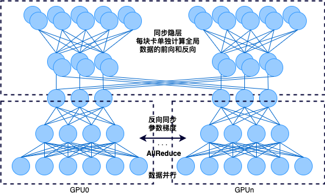

# 1. 飞桨底层分布式API的使用案例

本文档主要介绍如何使用飞桨底层分布式API，并基于此介绍如何使用飞桨底层分布式API实现模型并行。

## 1.1 飞桨底层分布式API简介

飞桨底层分布式API包括CPU和GPU实现。当前，飞桨实现以下分布式APIs：

| 名称       | CPU  | GPU  |
| ---------- | ---- | ---- |
| broadcast  | 支持 | 支持 |
| scatter    | 支持 | 支持 |
| barrier    | 支持 | 支持 |
| reduce     | 支持 | 支持 |
| all_reduce | 支持 | 支持 |
| all_gather | 支持 | 支持 |


## 1.2 飞桨底层分布式API使用案例

### 1.2.1 版本要求

* paddlepaddle 2.0-rc-gpu版本及以上

### 1.2.2 分布式API使用案例

在分布式训练过程中，综合采用数据并行和模型并行，具体地，卷积层采用数据并行，全连接层采用模型并行，即将全连接层划分到多个计算设备上，每个设备负责各自独立部分地全连接层计算。



### 1.2.3 动态图实现

上述过程描述地完整前向计算过程实现代码如下：

```python
# -*- coding: UTF-8 -*-
import paddle
import paddle.nn as nn

# 定义模型并行的全连接网络，需要继承自nn.Layer
class ModelParallelLinear(nn.Layer):
    def __init__(self,
                 in_dim,
                 rank_num,
                 rank_id,
                 class_num):
        super(ModelParallelLinear, self).__init__()
        if class_num % rank_num:
            raise ValueError("Number of classes must be divisible "
                             "the number of ranks.")
        shard_dims = class_num // rank_num
        self.linear = nn.Linear(in_dim, shard_dims)
        self.rank_num = rank_num
        self.rank_id = rank_id
    
    def forward(self, x):
        global_x_list = []
        paddle.distributed.all_gather(global_x_list, x)
        global_x = paddle.concat(global_x_list, axis=0)
        out = self.linear(global_x)
        global_out_list = []
        paddle.distributed.all_gather(global_out_list, out)
        all_outs = paddle.concat(global_out_list, axis=1)
        out = paddle.split(all_outs, rank_num)[rank_id]
        return out
```
完整地训练代码实现如下：
```python
# -*- coding: UTF-8 -*-
import paddle
import paddle.nn as nn
import paddle.nn.functional as F
from paddle.fluid.dygraph import Conv2D
#分布式step 1: 导入paddle.distributed.fleet包
from paddle.distributed import fleet
from model_parallel_linear import ModelParallelLinear

# 定义全连接网络，需继承自nn.Layer
class SimpleModelParallelClassifierNet(nn.Layer):
    def __init__(self,
                 class_num,
                 rank_num,
                 rank_id):
        super(SimpleModelParallelClassifierNet, self).__init__()
        self.conv1 = Conv2D(num_channels=1, num_filters=6, filter_size=5, act='sigmoid')
        self.max_pool1 = nn.Pool2D(pool_size=2, pool_stride=2, pool_type='max')
        self.conv2 = Conv2D(num_channels=6, num_filters=16, filter_size=5, act='sigmoid')
        self.max_pool2 = nn.Pool2D(pool_size=2, pool_stride=2, pool_type='max')
        self.conv3 = Conv2D(num_channels=16, num_filters=120, filter_size=4, act='sigmoid')
        self.model_parallel_linear = ModelParallelLinear(480,
                                                         rank_num,
                                                         rank_id,
                                                         class_num)
    
    def forward(x):
        x = self.conv1(x)
        x = self.max_pool1(x)
        x = self.conv2(x)
        x = self.max_pool2(x)
        x = self.conv3(x)
        x = paddle.reshape(x, [x.shape[0], -1])
        out = self.model_parallel_linear(x)
        return out

# 分布式step 2: 初始化fleet
fleet.init(is_collective=True)

# 1. 定义网络对象，损失函数和优化器
layer = SimpleModelParallelClassifierNet(class_num=10,
                                         rank_num=fleet.worker_num(),
                                         rank_id=fleet.worker_index())
adam = paddle.optimizer.Adam(learning_rate=0.001,
                             parameters=layer.parameters())

# 分布式step 3: 通过fleet获取分布式优化器和分布式模型
adam = fleet.distributed_optimizer(adam)
dp_layer = fleet.distributed_model(layer)


for step in range(20):
    # 2. 执行前向网络
    image = paddle.randn([1, 1, 32, 32], 'float32')
    label = paddle.randint(low=0, high=10, shape=[1,1])
    output = dp_layer(image)
    loss = F.softmax_with_cross_entropy(output, label)
    loss = paddle.mean(loss)

    print("step:{}\tloss:{}".format(step, loss.numpy()))

    # 3. 执行反向计算和参数更新
    # 分布式step 4: 在执行反向（backward函数）前后进行损失缩放和反向梯度的聚合
    loss = dp_layer.scale_loss(loss)
    loss.backward()
    dp_layer.apply_collective_grads()

    adam.step()
    adam.clear_grad()
```

将上述代码保存为train.py，假设要运行2卡任务，那么只需要在命令行执行下面的命令：

```shell
fleetrun --gpus=0,1 tain.py
```

### 1.2.4 静态图实现

```PYTHON
# -*- coding: UTF-8 -*-
import os
import numpy
import paddle
import paddle.static.nn as nn
import paddle.distributed.fleet as fleet

paddle.enable_static()

fleet.init(is_collective=True)

def simple_model_parallel_net(image,
                              label,
                              class_num,
                              rank_num,
                              rank_id):
    conv1 = nn.conv2d(image, num_filters=6, filter_size=5, act='sigmoid')
    max_pool1 = paddle.nn.functional.pool2d(conv1, pool_size=2, pool_type='max', pool_stride=2)
    conv2 = nn.conv2d(max_pool1, num_filters=16, filter_size=5, act='sigmoid')
    max_pool2 = paddle.nn.functional.pool2d(conv2, pool_size=2, pool_type='max', pool_stride=2)
    conv3 = nn.conv2d(max_pool2, num_filters=120, filter_size=4, act='sigmoid')
    conv3 = paddle.reshape(conv3, [conv3.shape[0], -1])

    if class_num % rank_num:
        raise ValueError("Number of classes must be divisible "
                         "the number of ranks.")
    shard_dims = class_num // rank_num
    global_x_list = []
    paddle.distributed.all_gather(global_x_list, conv3)
    global_x = paddle.concat(global_x_list, axis=0)
    out = nn.fc(global_x, size=shard_dims)
    global_out_list = []
    paddle.distributed.all_gather(global_out_list, out)
    all_outs = paddle.concat(global_out_list, axis=1)
    out = paddle.split(all_outs, rank_num)[rank_id]
    out = paddle.nn.functional.loss.cross_entropy(input=out, label=label)
    loss = paddle.mean(out)
    return loss
  
image = paddle.data(name="image", shape=[1, 1, 32, 32], dtype='float32')
label = paddle.data(name="label", shape=[1, 1], dtype='int64')


cost = simple_model_parallel_net(image,
                                 label,
                                 class_num=10,
                                 rank_num=fleet.worker_num(),
                                 rank_id=fleet.worker_index())

place = paddle.CUDAPlace(int(os.environ.get('FLAGS_selected_gpus', 0)))
strategy = fleet.DistributedStrategy()
optimizer = paddle.fluid.optimizer.Adam(learning_rate=0.001)
optimizer = fleet.distributed_optimizer(optimizer, strategy=strategy)
optimizer.minimize(cost)

exe = paddle.static.Executor(place)
exe.run(paddle.static.default_startup_program())

step = 20
for i in range(step):
    image_np = numpy.random.randn(1, 1, 32, 32).astype('float32')
    label_np = numpy.random.randint(low=0, high=10, size=[1,1])
    [loss] = exe.run(paddle.static.default_main_program(),
                     feed={'image': image_np, 'label': label_np},
                     fetch_list=[cost.name])
    print("step:{}\tloss:{}".format(i, loss))
```

